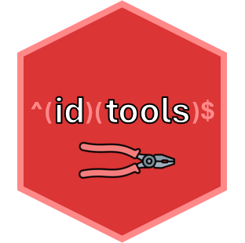

<!-- README.md is generated from README.Rmd. Please edit that file -->

```{r, include = FALSE}
knitr::opts_chunk$set(
  collapse = TRUE,
  comment = "#>",
  fig.path = "man/figures/README-",
  out.width = "100%"
)
```

# idtools <a href="https://joe-m-shaw.github.io/idtools/"></a>

<!-- badges: start -->
[](https://app.codecov.io/gh/joe-m-shaw/idtools)
<!-- badges: end -->

`idtools` is an R package for extracting sample identifiers from filenames at the
North West Genomic Laboratory Hub in Manchester, United Kingdom. 
It is intended to be used for internal use only, and can be used for 
validation or development projects, where key 
information, such as the DNA lab number, worksheet number and replicate suffix, 
are concatenated within a filename. 

The name is a pun on the concept of "tidy tools" from the ["Tidy Tools Manifesto"](https://tidyverse.tidyverse.org/articles/manifesto.html) by Hadley
Wickham.
`idtools` depends on the `dplyr` and `stringr` packages from the tidyverse, and 
is intended to be used with `purrr` and other tidyverse packages for exploratory
data analysis.

## Installation

You can install the development version of idtools from [GitHub](https://github.com/) with:

``` r
# install.packages("pak")
pak::pak("joe-m-shaw/idtools")
```

## Example

You can use `idtools` to extract sample identifiers stored in strings and
filenames.

```{r}

library(idtools)

filename <- "WS123456_12345678a"

extract_worksheet(filename)

extract_labno(filename)

extract_suffix(filename)

```

This is helpful if you have a dataframe of results from multiple files, with 
the filename in a separate column. 

```{r}

results_df <- data.frame(
  "file" = c("WS123456_12345678a_results.csv", "WS123456_23456789_results.csv"),
  "result" = c("Variant detected", "Variant not detected")
)

knitr::kable(results_df)

```

You can use the `mutate_ids` function with the pipe (|>) operator to quickly
extract the sample identifiers.

```{r}

results_with_ids <- results_df |> 
  mutate_ids(file)

knitr::kable(results_with_ids)

```

## Information Governance

**No patient identifiable information should be included in this
repository.**

For the purpose of testing functions, I have used generic examples for
worksheet (WS123456) and lab number (12345678) values.

Where examples of patient names are required, I have used character
names from novels by Leo Tolstoy (Anna Karenina, Pierre Bezukhov etc).

## Logo 

The `idtools` logo is made using an [Flaticon image created by Nuricon](https://www.flaticon.com/free-icon/crimping-pliers_10476996?term=plier&related_id=10476996).
