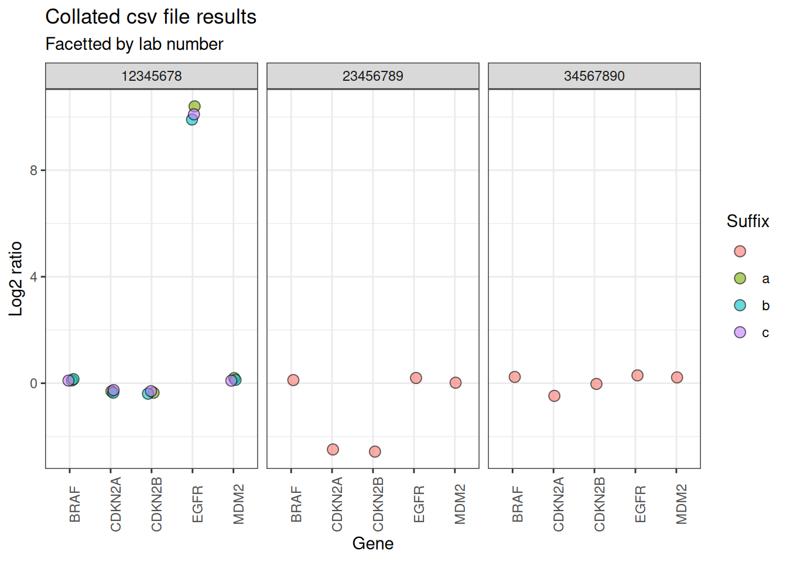

# Data analysis with idtools

`idtools` is designed to be used at the North West Genomic Laboratory
Hub for projects involving data analysis of multiple results files. This
vignette goes through an example of a common scenario where `idtools`
can help.

## Lots of files with long filenames

A common scenario faced in genetic test development is where there are
multiple files of results, and the identifiers for each sample are
included in long filenames.

Here is an example with 5 .csv files which contain gene dosage results
for fictional patients. All these files are saved in a folder called
“data”.

``` r

csv_files <- list.files(path = "data/",
           pattern = ".*.csv",
           full.names = TRUE)

csv_files
#> [1] "data//Gene_dosage_WS123456_12345678a_patient1.csv"
#> [2] "data//Gene_dosage_WS123456_12345678b_patient1.csv"
#> [3] "data//Gene_dosage_WS123456_12345678c_patient1.csv"
#> [4] "data//Gene_dosage_WS123456_23456789_patient2.csv" 
#> [5] "data//Gene_dosage_WS123456_34567890_patient3.csv"
```

Each .csv file contains the dosage (log2 ratio) results for 5 genes of
interest.

| gene   | log2r |
|:-------|------:|
| EGFR   | 10.40 |
| BRAF   |  0.10 |
| CDKN2A | -0.30 |
| CDKN2B | -0.35 |
| MDM2   |  0.20 |

Table 1: Contents of a single .csv file

In order to analyse the data, two steps need to be completed:

1.  The results from each individual file should be collated together in
    one dataframe

2.  The sample identifiers from each filename should be added to the
    dataframe as separate columns.

## Collating the results with `purrr` and `readr`

Collating the file contents can be achieved by applying the `read_csv`
function from `readr` to all the files, using the `map` function from
`purrr`. Specifying `id="filepath"` in the call to `read_csv` adds the
full filepath as a new column to the contents of each file.

``` r

csv_data <- csv_files |> 
  purrr::map(\(csv_files) readr::read_csv(csv_files,
                            id = "filepath",
                            show_col_types = FALSE)) |> 
  purrr::list_rbind() 
```

This creates a dataframe containing the results from all the csv files.

| filepath                                          | gene   | log2r |
|:--------------------------------------------------|:-------|------:|
| data//Gene_dosage_WS123456_12345678a_patient1.csv | EGFR   | 10.40 |
| data//Gene_dosage_WS123456_12345678a_patient1.csv | BRAF   |  0.10 |
| data//Gene_dosage_WS123456_12345678a_patient1.csv | CDKN2A | -0.30 |
| data//Gene_dosage_WS123456_12345678a_patient1.csv | CDKN2B | -0.35 |
| data//Gene_dosage_WS123456_12345678a_patient1.csv | MDM2   |  0.20 |
| data//Gene_dosage_WS123456_12345678b_patient1.csv | EGFR   |  9.90 |
| data//Gene_dosage_WS123456_12345678b_patient1.csv | BRAF   |  0.15 |
| data//Gene_dosage_WS123456_12345678b_patient1.csv | CDKN2A | -0.35 |
| data//Gene_dosage_WS123456_12345678b_patient1.csv | CDKN2B | -0.40 |
| data//Gene_dosage_WS123456_12345678b_patient1.csv | MDM2   |  0.12 |
| data//Gene_dosage_WS123456_12345678c_patient1.csv | EGFR   | 10.10 |
| data//Gene_dosage_WS123456_12345678c_patient1.csv | BRAF   |  0.10 |
| data//Gene_dosage_WS123456_12345678c_patient1.csv | CDKN2A | -0.25 |
| data//Gene_dosage_WS123456_12345678c_patient1.csv | CDKN2B | -0.30 |
| data//Gene_dosage_WS123456_12345678c_patient1.csv | MDM2   |  0.10 |
| data//Gene_dosage_WS123456_23456789_patient2.csv  | EGFR   |  0.20 |
| data//Gene_dosage_WS123456_23456789_patient2.csv  | BRAF   |  0.10 |
| data//Gene_dosage_WS123456_23456789_patient2.csv  | CDKN2A | -2.50 |
| data//Gene_dosage_WS123456_23456789_patient2.csv  | CDKN2B | -2.55 |
| data//Gene_dosage_WS123456_23456789_patient2.csv  | MDM2   |  0.01 |
| data//Gene_dosage_WS123456_34567890_patient3.csv  | EGFR   |  0.30 |
| data//Gene_dosage_WS123456_34567890_patient3.csv  | BRAF   |  0.20 |
| data//Gene_dosage_WS123456_34567890_patient3.csv  | CDKN2A | -0.50 |
| data//Gene_dosage_WS123456_34567890_patient3.csv  | CDKN2B |  0.01 |
| data//Gene_dosage_WS123456_34567890_patient3.csv  | MDM2   |  0.20 |

Table 2: Collated gene dosage data with filepaths

## Adding sample identifiers with `idtools`

The `mutate_ids` function from `idtools` can then be applied to the new
“filepath” column of the collated data. This function extracts the DNA
lab number (labno), replicate suffix and worksheet number from the
filepath, and adds each identifier as a new column.

``` r

csv_data_with_names <- csv_data |> 
  idtools::mutate_ids(id_col = filepath)
```

| filepath | labno | suffix | worksheet | labno_suffix | labno_suffix_worksheet | gene | log2r |
|:---|:---|:---|:---|:---|:---|:---|---:|
| data//Gene_dosage_WS123456_12345678a_patient1.csv | 12345678 | a | WS123456 | 12345678a | 12345678a_WS123456 | EGFR | 10.40 |
| data//Gene_dosage_WS123456_12345678a_patient1.csv | 12345678 | a | WS123456 | 12345678a | 12345678a_WS123456 | BRAF | 0.10 |
| data//Gene_dosage_WS123456_12345678a_patient1.csv | 12345678 | a | WS123456 | 12345678a | 12345678a_WS123456 | CDKN2A | -0.30 |
| data//Gene_dosage_WS123456_12345678a_patient1.csv | 12345678 | a | WS123456 | 12345678a | 12345678a_WS123456 | CDKN2B | -0.35 |
| data//Gene_dosage_WS123456_12345678a_patient1.csv | 12345678 | a | WS123456 | 12345678a | 12345678a_WS123456 | MDM2 | 0.20 |
| data//Gene_dosage_WS123456_12345678b_patient1.csv | 12345678 | b | WS123456 | 12345678b | 12345678b_WS123456 | EGFR | 9.90 |
| data//Gene_dosage_WS123456_12345678b_patient1.csv | 12345678 | b | WS123456 | 12345678b | 12345678b_WS123456 | BRAF | 0.15 |
| data//Gene_dosage_WS123456_12345678b_patient1.csv | 12345678 | b | WS123456 | 12345678b | 12345678b_WS123456 | CDKN2A | -0.35 |
| data//Gene_dosage_WS123456_12345678b_patient1.csv | 12345678 | b | WS123456 | 12345678b | 12345678b_WS123456 | CDKN2B | -0.40 |
| data//Gene_dosage_WS123456_12345678b_patient1.csv | 12345678 | b | WS123456 | 12345678b | 12345678b_WS123456 | MDM2 | 0.12 |
| data//Gene_dosage_WS123456_12345678c_patient1.csv | 12345678 | c | WS123456 | 12345678c | 12345678c_WS123456 | EGFR | 10.10 |
| data//Gene_dosage_WS123456_12345678c_patient1.csv | 12345678 | c | WS123456 | 12345678c | 12345678c_WS123456 | BRAF | 0.10 |
| data//Gene_dosage_WS123456_12345678c_patient1.csv | 12345678 | c | WS123456 | 12345678c | 12345678c_WS123456 | CDKN2A | -0.25 |
| data//Gene_dosage_WS123456_12345678c_patient1.csv | 12345678 | c | WS123456 | 12345678c | 12345678c_WS123456 | CDKN2B | -0.30 |
| data//Gene_dosage_WS123456_12345678c_patient1.csv | 12345678 | c | WS123456 | 12345678c | 12345678c_WS123456 | MDM2 | 0.10 |
| data//Gene_dosage_WS123456_23456789_patient2.csv | 23456789 |  | WS123456 | 23456789 | 23456789_WS123456 | EGFR | 0.20 |
| data//Gene_dosage_WS123456_23456789_patient2.csv | 23456789 |  | WS123456 | 23456789 | 23456789_WS123456 | BRAF | 0.10 |
| data//Gene_dosage_WS123456_23456789_patient2.csv | 23456789 |  | WS123456 | 23456789 | 23456789_WS123456 | CDKN2A | -2.50 |
| data//Gene_dosage_WS123456_23456789_patient2.csv | 23456789 |  | WS123456 | 23456789 | 23456789_WS123456 | CDKN2B | -2.55 |
| data//Gene_dosage_WS123456_23456789_patient2.csv | 23456789 |  | WS123456 | 23456789 | 23456789_WS123456 | MDM2 | 0.01 |
| data//Gene_dosage_WS123456_34567890_patient3.csv | 34567890 |  | WS123456 | 34567890 | 34567890_WS123456 | EGFR | 0.30 |
| data//Gene_dosage_WS123456_34567890_patient3.csv | 34567890 |  | WS123456 | 34567890 | 34567890_WS123456 | BRAF | 0.20 |
| data//Gene_dosage_WS123456_34567890_patient3.csv | 34567890 |  | WS123456 | 34567890 | 34567890_WS123456 | CDKN2A | -0.50 |
| data//Gene_dosage_WS123456_34567890_patient3.csv | 34567890 |  | WS123456 | 34567890 | 34567890_WS123456 | CDKN2B | 0.01 |
| data//Gene_dosage_WS123456_34567890_patient3.csv | 34567890 |  | WS123456 | 34567890 | 34567890_WS123456 | MDM2 | 0.20 |

Table 3: Collated gene dosage data with separated identifiers

## Analysing the collated data

Now that the data is all together in a single dataframe, including the
sample identifiers, it can be more easily analysed.

For example, the data can be quickly filtered to return only the results
for the *EGFR* gene.

``` r

knitr::kable(csv_data_with_names |> 
  dplyr::filter(gene == "EGFR"))
```

| filepath | labno | suffix | worksheet | labno_suffix | labno_suffix_worksheet | gene | log2r |
|:---|:---|:---|:---|:---|:---|:---|---:|
| data//Gene_dosage_WS123456_12345678a_patient1.csv | 12345678 | a | WS123456 | 12345678a | 12345678a_WS123456 | EGFR | 10.4 |
| data//Gene_dosage_WS123456_12345678b_patient1.csv | 12345678 | b | WS123456 | 12345678b | 12345678b_WS123456 | EGFR | 9.9 |
| data//Gene_dosage_WS123456_12345678c_patient1.csv | 12345678 | c | WS123456 | 12345678c | 12345678c_WS123456 | EGFR | 10.1 |
| data//Gene_dosage_WS123456_23456789_patient2.csv | 23456789 |  | WS123456 | 23456789 | 23456789_WS123456 | EGFR | 0.2 |
| data//Gene_dosage_WS123456_34567890_patient3.csv | 34567890 |  | WS123456 | 34567890 | 34567890_WS123456 | EGFR | 0.3 |

Table 4: Results for EGFR gene

The data can also be filtered to show the results for the 3 different
replicates of sample 12345678.

``` r

knitr::kable(csv_data_with_names |> 
  dplyr::filter(labno == "12345678"))
```

| filepath | labno | suffix | worksheet | labno_suffix | labno_suffix_worksheet | gene | log2r |
|:---|:---|:---|:---|:---|:---|:---|---:|
| data//Gene_dosage_WS123456_12345678a_patient1.csv | 12345678 | a | WS123456 | 12345678a | 12345678a_WS123456 | EGFR | 10.40 |
| data//Gene_dosage_WS123456_12345678a_patient1.csv | 12345678 | a | WS123456 | 12345678a | 12345678a_WS123456 | BRAF | 0.10 |
| data//Gene_dosage_WS123456_12345678a_patient1.csv | 12345678 | a | WS123456 | 12345678a | 12345678a_WS123456 | CDKN2A | -0.30 |
| data//Gene_dosage_WS123456_12345678a_patient1.csv | 12345678 | a | WS123456 | 12345678a | 12345678a_WS123456 | CDKN2B | -0.35 |
| data//Gene_dosage_WS123456_12345678a_patient1.csv | 12345678 | a | WS123456 | 12345678a | 12345678a_WS123456 | MDM2 | 0.20 |
| data//Gene_dosage_WS123456_12345678b_patient1.csv | 12345678 | b | WS123456 | 12345678b | 12345678b_WS123456 | EGFR | 9.90 |
| data//Gene_dosage_WS123456_12345678b_patient1.csv | 12345678 | b | WS123456 | 12345678b | 12345678b_WS123456 | BRAF | 0.15 |
| data//Gene_dosage_WS123456_12345678b_patient1.csv | 12345678 | b | WS123456 | 12345678b | 12345678b_WS123456 | CDKN2A | -0.35 |
| data//Gene_dosage_WS123456_12345678b_patient1.csv | 12345678 | b | WS123456 | 12345678b | 12345678b_WS123456 | CDKN2B | -0.40 |
| data//Gene_dosage_WS123456_12345678b_patient1.csv | 12345678 | b | WS123456 | 12345678b | 12345678b_WS123456 | MDM2 | 0.12 |
| data//Gene_dosage_WS123456_12345678c_patient1.csv | 12345678 | c | WS123456 | 12345678c | 12345678c_WS123456 | EGFR | 10.10 |
| data//Gene_dosage_WS123456_12345678c_patient1.csv | 12345678 | c | WS123456 | 12345678c | 12345678c_WS123456 | BRAF | 0.10 |
| data//Gene_dosage_WS123456_12345678c_patient1.csv | 12345678 | c | WS123456 | 12345678c | 12345678c_WS123456 | CDKN2A | -0.25 |
| data//Gene_dosage_WS123456_12345678c_patient1.csv | 12345678 | c | WS123456 | 12345678c | 12345678c_WS123456 | CDKN2B | -0.30 |
| data//Gene_dosage_WS123456_12345678c_patient1.csv | 12345678 | c | WS123456 | 12345678c | 12345678c_WS123456 | MDM2 | 0.10 |

Table 5: Results for sample 12345678

And the `ggplot2` package from the tidyverse can be used to visualise
all the results. This shows the *EGFR* amplification clearly present in
sample 12345678, including some variation between the 3 replicates for
this sample, and the codeletion of *CDKN2A* and *CDKN2B* for sample
23456789.

``` r

ggplot(csv_data_with_names, aes(x = gene, y = log2r)) +
  geom_jitter(shape = 21, size = 3,
              alpha = 0.6, width = 0.1, aes(fill = suffix)) +
  theme_bw()+
  theme(axis.text.x = element_text(angle = 90)) +
  facet_wrap(~labno) +
  labs(x = "Gene", y = "Log2 ratio",
       title = "Collated csv file results",
       subtitle = "Facetted by lab number",
       fill = "Suffix")
```



## Reading different file types

The same data folder also contains 5 Excel files of quality control
information. However, the filename format is different: the identifiers
are in a different order to the csv files, and hyphens are used instead
of underscores.

``` r

xlsx_files <- list.files(path = "data/",
           pattern = ".*.xlsx",
           full.names = TRUE)

xlsx_files
#> [1] "data//Quality-control-patient1-12345678a-WS123456.xlsx"
#> [2] "data//Quality-control-patient1-12345678b-WS123456.xlsx"
#> [3] "data//Quality-control-patient1-12345678c-WS123456.xlsx"
#> [4] "data//Quality-control-patient2-23456789-WS123456.xlsx" 
#> [5] "data//Quality-control-patient3-34567890-WS123456.xlsx"

csv_files
#> [1] "data//Gene_dosage_WS123456_12345678a_patient1.csv"
#> [2] "data//Gene_dosage_WS123456_12345678b_patient1.csv"
#> [3] "data//Gene_dosage_WS123456_12345678c_patient1.csv"
#> [4] "data//Gene_dosage_WS123456_23456789_patient2.csv" 
#> [5] "data//Gene_dosage_WS123456_34567890_patient3.csv"
```

Each file contains the “noise” metric for each sample replicate.

| metric | value |
|:-------|------:|
| noise  |   0.2 |

Table 6: Contents of a single .xlsx file

Similarly to before, the contents of the xlsx files can be collated
together using the `readxl` package. The `read_excel` function from
`readxl` does not include an option to add the filepath as a separate
column, so an alternative approach is to use `set_names` and the
“names_to” argument in `list_rbind` to achieve the same result.

``` r

xlsx_data <- xlsx_files |> 
  purrr::map(\(xlsx_files) readxl::read_excel(xlsx_files)) |> 
  rlang::set_names(xlsx_files) |> 
  purrr::list_rbind(names_to = "filepath") 
```

| filepath                                               | metric | value |
|:-------------------------------------------------------|:-------|------:|
| data//Quality-control-patient1-12345678a-WS123456.xlsx | noise  |  0.20 |
| data//Quality-control-patient1-12345678b-WS123456.xlsx | noise  |  0.30 |
| data//Quality-control-patient1-12345678c-WS123456.xlsx | noise  |  0.25 |
| data//Quality-control-patient2-23456789-WS123456.xlsx  | noise  |  0.30 |
| data//Quality-control-patient3-34567890-WS123456.xlsx  | noise  |  0.15 |

Table 7: Collated quality metric data with filepaths

Then, just as with the csv files, the identifiers can be extracted using
`mutate_ids`. Importantly, this process still works even though the
filename format has changed.

``` r

xlsx_data_with_names <- xlsx_data |> 
  idtools::mutate_ids(id_col = filepath)
```

| filepath | labno | suffix | worksheet | labno_suffix | labno_suffix_worksheet | metric | value |
|:---|:---|:---|:---|:---|:---|:---|---:|
| data//Quality-control-patient1-12345678a-WS123456.xlsx | 12345678 | a | WS123456 | 12345678a | 12345678a_WS123456 | noise | 0.20 |
| data//Quality-control-patient1-12345678b-WS123456.xlsx | 12345678 | b | WS123456 | 12345678b | 12345678b_WS123456 | noise | 0.30 |
| data//Quality-control-patient1-12345678c-WS123456.xlsx | 12345678 | c | WS123456 | 12345678c | 12345678c_WS123456 | noise | 0.25 |
| data//Quality-control-patient2-23456789-WS123456.xlsx | 23456789 |  | WS123456 | 23456789 | 23456789_WS123456 | noise | 0.30 |
| data//Quality-control-patient3-34567890-WS123456.xlsx | 34567890 |  | WS123456 | 34567890 | 34567890_WS123456 | noise | 0.15 |

Table 8: Collated quality metric data with separate identifiers

## Summary

`idtools` can be combined with tidyverse packages like `purrr` and
`readr` for streamlining data analysis in development projects. This
vignette has focussed on the labno, suffix and worksheet identifiers,
but a full list of the supported identifiers can be found in the
documentation for the `regex_ids` function.
